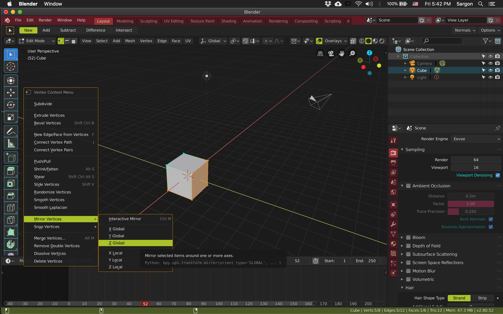

# Argon-5

A bold, darker, and fruity theme for Blender 2.8. (Still in development)

A spiritual successor of [monokai-blender](https://github.com/5argon/monokai-blender). Inspired by the popular text editor theme "Monokai".

## Features

- Darker than the default Blender Dark. About the same as "dark" of Adobe software.
- Very dark theme often features colors that are too neon, this theme is for user that wanted a dark theme with more tame pallette.
- Almost black 3D View. Camera and lights are now bright. Unselected vertexes and edges also got flipped to light blue.
- Checkboxes also colorize the text for person who often missed at a glance which one are checked.
- Toggle and value slider got a different color.
- Other key colors tries to stay default as much as possible unless it has usability issue with very dark color.